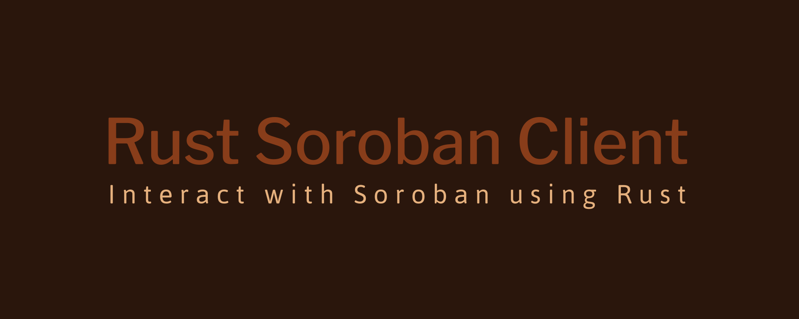

# Rust Soroban Client Library




A Rust client library for interacting with Soroban smart contracts on the Stellar blockchain

**This project is currently in early development and is not yet functional. It is a work in progress and is subject to significant changes, including the addition or removal of features and modifications to its functionality.**

## Quickstart

Add this to your Cargo.toml:

```toml
[dependencies]
soroban-client = "0.3.5"
```

And this to your code:

```rust
use soroban_client::*;
```

## Crate Docs

([Link](https://docs.rs/soroban-client/0.3.4/soroban_client/))

## Description

**The library is composed of 3 components**:

1. **[rs-stellar-xdr](https://github.com/stellar/rs-stellar-xdr)**: a low-level library for encoding/decoding XDR data. This has already been developed by the Stellar Core team.
2. **[rs-stellar-base](https://github.com/rahul-soshte/rs-stellar-base)**: a library that offers a comprehensive set of functions for reading, writing, hashing, and signing primitive XDR constructs utilized in the Stellar network. It provides a nice abstraction for building and signing transactions.
3. **[rs-soroban-client](https://github.com/rahul-soshte/rs-soroban-client)**: A high-level rust library that serves as client-side API for Horizon client. Useful for communicating with a Soroban RPC server.

This library will enable developers to seamlessly integrate Soroban functionality into their Rust-based applications and services. Most of the groundwork has already been laid by the Stellar team by building the xdr library and  rust stellar strkey implementation. This particular library has been the missing piece for soroban and the rust community at large in the stellar ecosystem.


## Sample Usage of the library

```rust
// Submitting a transaction
use soroban_client::Server;
use soroban_client::Networks;
use soroban_client::TransactionBuilder;
use soroban_client::Keypair;

#[tokio::main]
async fn main() {
    let server = Server::new("http://localhost:8000/soroban/rpc").unwrap();
    let public_key = "..."; // Replace with the actual public key
    let secret_string = "..."; // Replace with the actual secret key
    let contract_id = "..."; // Replace with the actual contract ID

    let account = server.get_account(public_key).await.unwrap();

    // Fee hardcoded for this example.
    let fee = 100;

    let contract = Contract::new(contract_id).unwrap();

    let mut transaction = TransactionBuilder::new(&account, fee, Networks::STANDALONE)
        .add_operation(
            // An operation to call increment on the contract
            contract.call("increment").unwrap(),
        )
        .set_timeout(30)
        .build();

    // Simulate the transaction to discover the storage footprint, and update the
    // transaction to include it. If you already know the storage footprint you
    // can use `add_footprint` to add it yourself, skipping this step.
    transaction = server.prepare_transaction(transaction).await.unwrap();

    // Sign the transaction
    let secret_key = Keypair::from_secret(secret_string).unwrap();
    transaction.sign(&secret_key);

    match server.send_transaction(transaction).await {
        Ok(transaction_result) => {
            println!("{:?}", transaction_result);
        }
        Err(err) => {
            eprintln!("{:?}", err);
        }
    }
}
```

## Getting Help

Join the [discord server](https://discord.gg/mH9R2mw9tP) to chat with the community!

## Practical Use Case

Suppose someone wants to build a trading bot targeting a DEX built on Soroban itself. This bot executes a large number of trades within a short period, often leveraging market inefficiencies and price discrepancies.  A Rust client library for Soroban would provide the person with a performant toolset to build trading algorithms, interact with the Stellar network, and execute trades with minimal latency.


## Authors

Rahul Soshte ([Twitter](https://twitter.com/RahulSoshte))
