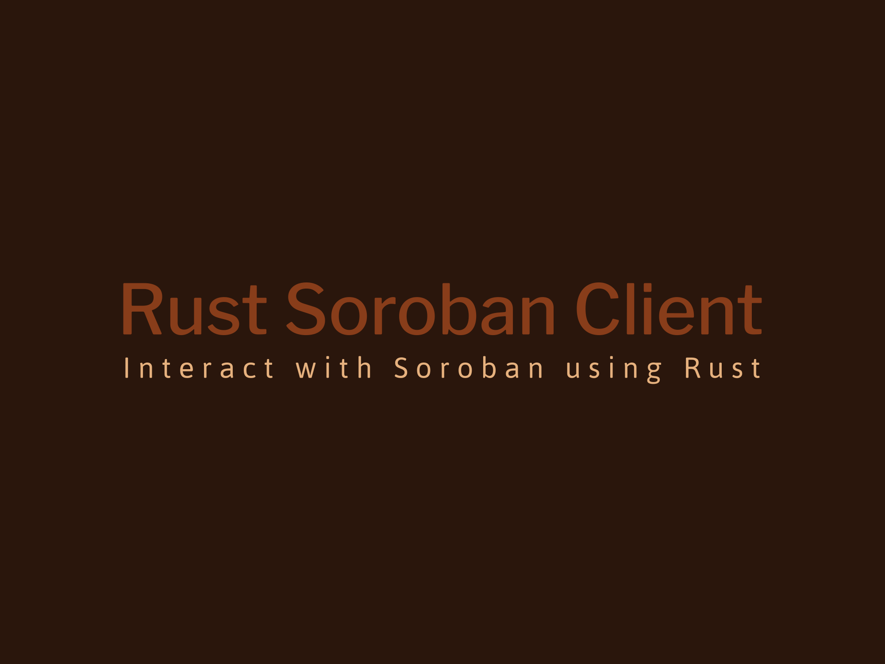

# Rust Soroban Client Library




A Rust client library for interacting with Soroban smart contracts on the Stellar blockchain

**This project is currently in production and is compatible with Protocol 28 and you can use it for building and signing transactions that involve interacting with Soroban and also supports all stellar classic operations.**

## Quickstart

Add this to your Cargo.toml:

```toml
[dependencies]
soroban-client = "0.6.0"
```

And this to your code:

```rust
use soroban_client::*;
```

## Crate Docs

[Docs Link](https://docs.rs/soroban-client/latest/soroban_client/)

## Description

**The library is composed of 3 components**:

1. **[rs-stellar-xdr](https://github.com/stellar/rs-stellar-xdr)**: a low-level library for encoding/decoding XDR data. This has already been developed by the Stellar Core team.
2. **[rs-stellar-base](https://github.com/rahul-soshte/rs-stellar-base)**: a library that offers a comprehensive set of functions for reading, writing, hashing, and signing primitive XDR constructs utilized in the Stellar network. It provides a nice abstraction for building and signing transactions.
3. **[rs-soroban-client](https://github.com/rahul-soshte/rs-soroban-client)**: A high-level rust library that serves as client-side API for the Soroban Environment. Useful for communicating with a Soroban RPC server.

This library will enable developers to seamlessly integrate Soroban functionality into their Rust-based applications and services. Most of the groundwork has already been laid by the Stellar team by building the xdr library and  rust stellar strkey implementation. This particular library has been the missing piece for soroban and the rust community at large in the stellar ecosystem.

## Auth credentials (CAP-0071) — v2 by default

Since Protocol 28 (matching js-stellar-sdk v17), the SDK defaults to CAP-0071 v2
auth credentials on both ends of the flow: `simulate_transaction` sends
`useUpgradedAuth: true`, so recording-mode simulation returns
`SOROBAN_CREDENTIALS_ADDRESS_V2` entries, and `authorize_entry` upgrades legacy
entries to v2 when signing. V2 credentials bind the credential address into the
signed payload, preventing replay across accounts sharing a key.

To keep the legacy v1 behavior, opt out explicitly:

```rust
let simulation = rpc
    .simulate_transaction(
        &tx,
        Some(SimulationOptions {
            auth_mode: Some(AuthMode::Record),
            use_upgraded_auth: Some(false), // legacy v1 opt-out
            ..Default::default()
        }),
    )
    .await?;
```

`authorize_entry` picks the signing preimage from the credential arm, so v2 entries
returned by simulation are signed correctly without any change on your side. Only
hand-rolled signing code needs an audit: v2 entries must use
`ENVELOPE_TYPE_SOROBAN_AUTHORIZATION_WITH_ADDRESS`, not
`ENVELOPE_TYPE_SOROBAN_AUTHORIZATION`. See `cargo run --example authorize_entry_demo`.

## External contract executables (CAP-0085, Protocol 28)

A contract instance can hold an external executable reference (an owner contract
plus a tag) instead of its own wasm hash. The SDK resolves and deploys these:

```rust
// Resolve a reference to its wasm hash (one extra getLedgerEntries call)
let wasm_hash = rpc.get_external_ref_wasm_hash(ext_ref).await?;

// Or fetch a contract's wasm directly; external refs are resolved transparently
let wasm = rpc.get_contract_wasm_by_contract_id("CA3D...").await?;

// Deploy a new contract from an external reference
let op = Operation::new().create_contract_from_external_ref(
    &deployer, &executable_owner, b"tag", None, None, vec![],
)?;
```

## Running Examples

```bash
cargo run --example create_account
cargo run --example payment
cargo run --example deploy
cargo run --example authorize_entry_demo
cargo run --example upgraded_auth_e2e   # hits testnet, funds two accounts
cargo run --example p28_e2e             # hits testnet: CAP-71 default flip, wasm fetchers, full CAP-85 flow
```

## Sample Demo of the library

[Demo Link](sdemo/src/main.rs)


## Getting Help

Join the [discord server](https://discord.gg/mH9R2mw9tP) to chat with the community!

## Practical Use Case

Suppose someone wants to build a trading bot targeting a DEX built on Soroban itself. This bot executes a large number of trades within a short period, often leveraging market inefficiencies and price discrepancies.  A Rust client library for Soroban would provide the person with a performant toolset to build trading algorithms, interact with the Stellar network, and execute trades with minimal latency.


## Authors

Rahul Soshte ([Twitter](https://twitter.com/RahulSoshte))
